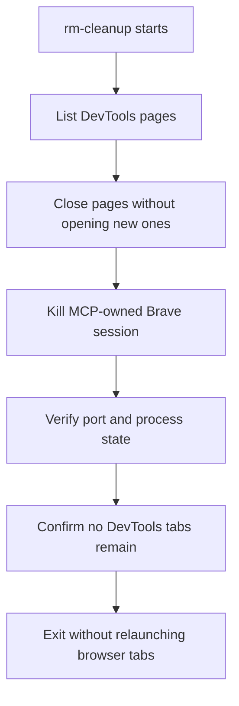

# Fix: Stop Chrome DevTools MCP from Reopening Blank Tabs

## Overview

The `rm-cleanup` workflow is leaving the Chrome DevTools MCP browser session alive with `about:blank` tabs, and the session can reappear on subsequent cleanup runs. The current behavior is confusing because the cleanup skill closes visible tabs, but the MCP/browser lifecycle still retains or recreates blank pages, so the environment never reaches a truly closed state.

## Problem Frame

The cleanup workflow is meant to terminate the agent-owned Brave/DevTools session, not just close whatever pages happen to be visible at the moment. Today there is a mismatch between three surfaces:

- `rm-cleanup` assumes closing listed pages plus killing the MCP-owned Brave process is enough.
- `rm-dev-workflows` already warns against creating blank tabs and recommends reusing existing tabs.
- `opencode.json` configures `chrome-devtools-mcp`, while repo docs imply a more isolated browser lifecycle than the live config appears to provide.

The result is a recurring tab-lifecycle bug: blank tabs remain or return, which makes cleanup look incomplete and causes repeated confusion during subsequent runs.

## Requirements Trace

- R1. The cleanup workflow must end with no leftover MCP-owned DevTools tabs when the session is supposed to be closed.
- R2. The cleanup workflow must not reopen DevTools pages as part of verification or teardown.
- R3. The browser automation guidance must consistently prefer tab reuse and URL-targeted navigation over creating blank tabs.
- R4. Repo docs and MCP configuration must describe the same browser lifecycle behavior.

## Scope Boundaries

- **In scope:** `rm-cleanup`, `rm-dev-workflows`, `opencode.json`, and any adjacent docs that describe Chrome DevTools MCP behavior.
- **Out of scope:** changes to app code, cleanup of unrelated Brave sessions, or redesigning the broader opencode agent stack.

## Context & Research

### Relevant Code and Patterns

- `.opencode/skills/rm-cleanup/SKILL.md` — current cleanup flow closes pages and kills the MCP-owned Brave process, but does not explicitly prevent or verify blank-tab persistence.
- `.opencode/skills/rm-dev-workflows/SKILL.md` — already contains the repo’s canonical tab hygiene rule: always pass `url`, reuse pages, never leave blank tabs open.
- `opencode.json` — current `chrome-devtools` MCP entry launches Brave directly, and this config is the likely lifecycle control point.
- `README.md` — currently documents Chrome DevTools MCP setup; it should match the actual runtime behavior.

### Institutional Learnings

- `rm-dev-workflows` is already the canonical place for tab discipline.
- Operational instructions drift unless the skill, config, and docs all tell the same story.
- There is no existing `docs/solutions/` entry for Chrome DevTools MCP lifecycle or blank-tab suppression, so this is undocumented behavior worth preserving after the fix.

### External References

- Chrome DevTools MCP issue results indicate blank/about:blank tab behavior is a known pain point in the ecosystem.
- Repo docs currently reference isolated cleanup behavior, but the live config needs to match the intended lifecycle model.

## Key Technical Decisions

- **Treat the bug as a lifecycle/configuration problem, not just a cleanup-script problem.**
  - Rationale: the blank tabs reappear because the MCP browser session itself is not being managed consistently.
- **Align the cleanup skill and workflow guidance with the actual MCP launch behavior.**
  - Rationale: the skill should describe what the environment can reliably do, not just the desired end state.
- **Preserve tab-reuse guidance as the default browser-automation rule.**
  - Rationale: preventing new blank tabs is cheaper and safer than trying to clean them up repeatedly.

## Open Questions

### Resolved During Planning

- The bug is not limited to `rm-cleanup`; the underlying Chrome DevTools MCP lifecycle/configuration also needs review.
- The existing `rm-dev-workflows` tab discipline should be retained and strengthened rather than replaced.

### Deferred to Implementation

- Whether the minimal fix is to add or adjust an isolation flag in `opencode.json`, tighten teardown behavior in `rm-cleanup`, or do both.
- Whether repo docs need a small note clarifying that the cleanup workflow intentionally closes only the MCP-owned DevTools session and should not reopen pages during verification.

## High-Level Technical Design

> _This illustrates the intended approach and is directional guidance for review, not implementation specification. The implementing agent should treat it as context, not code to reproduce._

## Implementation Units

- [ ] **Unit 1: Align Chrome DevTools MCP launch/configuration with closed-session behavior**

**Goal:** Make the MCP browser session lifecycle match the intended cleanup behavior so blank tabs are not recreated by default.

**Requirements:** R1, R2, R4

**Dependencies:** None

**Files:**

- Modify: `opencode.json`
- Modify: `README.md` if the documented MCP launch behavior needs to be updated

**Approach:**

- Review the current `chrome-devtools` MCP launch options and align them with the intended isolated/closed-session behavior.
- Keep the change minimal: adjust the browser lifecycle at the config layer rather than teaching every workflow to compensate for a leaky session.

**Patterns to follow:**

- Existing `opencode.json` MCP definitions and local launch style.
- Existing repo documentation tone for tool setup and agent workflows.

**Test scenarios:**

- Happy path: the MCP session starts, opens no unnecessary blank tabs, and can be closed without reopening pages during cleanup.
- Edge case: a preexisting tab list is empty; the cleanup flow still exits cleanly without spawning a new `about:blank` page.
- Error path: the launch config is inconsistent with the docs; the updated documentation reflects the real behavior so future runs do not reintroduce the issue.
- Integration: a fresh session launched from config behaves the same way the cleanup skill expects when it closes the DevTools pages.

**Verification:**

- The config and docs describe the same Chrome DevTools MCP lifecycle.
- Cleanup runs no longer leave behind a retained blank-tab session as the default end state.

- [ ] **Unit 2: Tighten rm-cleanup teardown to avoid reopening DevTools tabs**

**Goal:** Ensure the cleanup workflow only closes existing pages and tears down the MCP-owned browser session, without creating new pages during verification.

**Requirements:** R1, R2

**Dependencies:** Unit 1

**Files:**

- Modify: `.opencode/skills/rm-cleanup/SKILL.md`

**Approach:**

- Make the teardown sequence explicit about not reopening tabs after closure.
- Clarify the order of operations so the workflow closes pages first, then terminates the MCP-owned Brave session, then verifies the environment without any browser relaunch step.
- If the session cannot be fully closed because the MCP leaves one page open, the skill should document that as a known platform constraint and avoid trying to work around it by creating new tabs.

**Patterns to follow:**

- Existing cleanup skill structure with browser/server/filesystem phases.
- The repo’s “zero tab accumulation” language in `rm-dev-workflows`.

**Test scenarios:**

- Happy path: all listed DevTools pages are closed and no new tabs are opened during teardown.
- Edge case: only one page remains open and the MCP refuses to close the last page; the skill reports the constraint instead of reopening a page.
- Error path: Brave/process termination fails; the skill surfaces the failure clearly rather than retrying in a way that recreates tabs.
- Integration: after teardown, a follow-up `chrome-devtools_list_pages` call shows no reopened pages beyond the platform’s unavoidable last-page behavior.

**Verification:**

- Cleanup no longer includes any step that could reopen DevTools pages.
- The skill text clearly separates closure, termination, and verification.

- [ ] **Unit 3: Refresh workflow guidance and document the behavior gap**

**Goal:** Keep repo guidance consistent so future cleanup/browser tasks inherit the corrected tab discipline.

**Requirements:** R3, R4

**Dependencies:** Units 1 and 2

**Files:**

- Modify: `.opencode/skills/rm-dev-workflows/SKILL.md`
- Modify: `README.md` and/or `.devcontainer/README.md` if they currently imply the wrong lifecycle model
- Optional: add a `docs/solutions/` note if the fix is sufficiently subtle to recur

**Approach:**

- Strengthen the existing tab-management guidance so it clearly covers the close-only cleanup case.
- Keep the wording operational and concise: the goal is to prevent reintroduction of blank-tab behavior, not to document every internal implementation detail.

**Patterns to follow:**

- The existing “Chrome DevTools Tab Management” section in `rm-dev-workflows`.
- The repo’s short, trigger-oriented documentation style for operational workflows.

**Test scenarios:**

- Happy path: a reader of the workflow docs would know to reuse tabs and avoid creating blank pages.
- Edge case: a developer only reads setup docs; they still see enough lifecycle guidance to avoid reintroducing the bug.
- Integration: the cleanup skill, workflow guidance, and MCP config all describe the same desired end state.

**Verification:**

- The repo no longer has conflicting guidance about DevTools tab lifecycle.
- The behavior gap is documented enough that future cleanup changes are less likely to regress.

## System-Wide Impact

- **Interaction graph:** `rm-cleanup` → `chrome-devtools` MCP session → Brave process lifecycle → tab state seen by later cleanup runs.
- **State lifecycle risks:** the bug is stateful; a lingering browser session can make later runs look broken even when the server is clean.
- **Unchanged invariants:** the cleanup workflow still targets the agent-owned Brave/DevTools session and should not affect the user’s main browser.

## Risks & Dependencies

| Risk                                                         | Mitigation                                                                                  |
| ------------------------------------------------------------ | ------------------------------------------------------------------------------------------- |
| The MCP/browser package may keep one last tab open by design | Document the limitation clearly and avoid treating it as a new page that should be reopened |
| Config and docs drift again                                  | Update the config, workflow skill, and docs together                                        |
| Over-correcting could close the wrong Brave session          | Keep the PID/profile match explicit and preserve the agent-owned-only constraint            |

## Documentation / Operational Notes

- Keep `rm-dev-workflows` as the canonical browser-tab hygiene reference.
- If the lifecycle fix depends on a config change, update docs alongside it so the repo’s operational story stays truthful.

## Sources & References

- **Origin document:** none
- Related code: `.opencode/skills/rm-cleanup/SKILL.md`
- Related code: `.opencode/skills/rm-dev-workflows/SKILL.md`
- Related code: `opencode.json`
- Related docs: `README.md`, `.devcontainer/README.md`
- Related prior art: `docs/plans/2026-04-03-001-fix-wasm-metrics-collection-plan.md`
