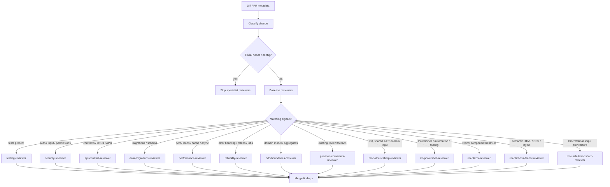

# Selective reviewer routing for CE and rm agents

## Overview

The current `ce:review` flow loads too many reviewers too often, and the local `rm-*` reviewers still sit outside the CE routing model. This plan narrows review activation so each agent only runs when the diff actually contains its domain: tests, security, contracts, migrations, PR threads, domain-boundary changes, or the Blazor/PowerShell/C# surfaces the `rm-*` agents own.

## Problem Frame

The repo already has a strong reviewer stack, but the default `ce:review` path still fans out broadly and does not yet treat the `rm-*` reviewers as first-class participants. That wastes tokens on small diffs and makes low-risk changes pay for specialist reviewers that cannot add value. The goal is to keep review quality high while making activation deterministic, conservative, cheap, and inclusive of the local `rm-*` reviewers where they add unique value.

## Requirements Trace

- R1. Small or trivial diffs should not trigger the full reviewer set.
- R2. `testing-reviewer` should run only when tests exist in scope or the change adds behavior that nearby tests can validate.
- R3. Security, performance, reliability, API-contract, data-migration, and maintainability reviewers should activate only on matching signals.
- R4. Vendor reviewer agents should remain dormant unless the router explicitly selects them.
- R5. Project standards checks should only run for instruction/config/doc surfaces, not every ordinary code diff.
- R6. The routing rules must stay readable and easy to tune as the repo evolves.
- R7. The five `rm-*` reviewers should be integrated into `ce:review` as stack-specific conditionals rather than remaining standalone-only agents.
- R8. Mixed Razor diffs should have a clear primary reviewer boundary between component behavior (`rm-blazor-reviewer`) and semantic HTML/CSS (`rm-html-css-blazor-reviewer`).

## Scope Boundaries

- Do not redesign OpenCode itself.
- Do not move review policy into `AGENTS.md` startup context.
- Do not rename the reviewer personalities again unless a name is still ambiguous after routing is fixed.
- Do not broaden the always-on reviewer set just to preserve current behavior.

## Context & Research

### Relevant Code and Patterns

- `.opencode/skills/ce/ce-review/SKILL.md` currently dispatches a large always-on + conditional matrix.
- `.opencode/skills/ce/ce-review/references/persona-catalog.md` already centralizes reviewer ownership and selection hints.
- `.opencode/agents/ce/*.md` contains the current CE reviewer personas.
- `.opencode/agents/vendor/*.md` contains the imported single-purpose reviewers.
- `.opencode/agents/rm-dotnet-csharp-reviewer.md`, `.opencode/agents/rm-powershell-reviewer.md`, `.opencode/agents/rm-blazor-reviewer.md`, and `.opencode/agents/rm-html-css-blazor-reviewer.md` define the local stack-specific reviewers that need CE routing.
- `.opencode/agents/rm-uncle-bob-csharp-reviewer.md` adds a second C#-focused lens for craftsmanship and architecture-heavy diffs.
- `opencode.json` already keeps startup context small and defines agent defaults/permissions.
- `docs/plans/2026-04-05-009-refactor-rm-reviewer-ce-alignment-plan.md` captures the CE-style trigger/output alignment for the five `rm-*` reviewers.

### Institutional Learnings

- `docs/solutions/integration-issues/opencode-instruction-architecture-pattern-2026-04-03.md` — keep instruction content lazy-loaded and avoid eager startup bloat.
- `docs/solutions/integration-issues/fix-skill-overtriggering-2026-04-03.md` — trigger language must be narrow, explicit, and exclusionary.
- `docs/solutions/integration-issues/opencode-instruction-management-lessons-2026-04-03.md` — avoid collisions; keep responsibilities isolated.
- `docs/solutions/integration-issues/opencode-ce-package-update-recovery-procedure-2026-04-05.md` — future recovery steps when package updates overwrite local reviewer edits.

### External References

- OpenCode Agents docs: `hidden` hides an agent from autocomplete; `permission.task` controls which subagents can be invoked.
- OpenCode Agent Skills docs: skills load on demand and are only worth keeping when they are specific enough to select correctly.
- Agent Skills standard: descriptions should be precise enough to avoid broad, token-wasting activation.

## Key Technical Decisions

- Keep routing inside `ce:review`; do not add more eager global instructions.
- Treat review as a tiered decision: baseline, conditional, and high-risk.
- Make test review conditional on a real test surface; do not spend tokens on test analysis when there are no tests to analyze.
- Hide vendor agents from normal discovery and only let the router select them.
- Use path signals, diff size, and PR metadata before using broad semantic heuristics.
- Add the `rm-*` reviewers as a stack-specific conditional layer inside the same routing model, not as a separate workflow.
- Keep `rm-blazor-reviewer` and `rm-html-css-blazor-reviewer` intentionally non-overlapping so mixed Razor changes have a clear primary lens.
- Route `rm-uncle-bob-csharp-reviewer` for C# diffs where architecture, dependency direction, testability, or craftsmanship are the primary concern.

## Open Questions

### Resolved During Planning

- Should routing be centralized? Yes — a single `ce:review` decision table is easier to tune than scattered per-agent rules.
- Should vendor reviewers stay in `vendor/`? Yes — keep provenance and update safety.
- Should the `rm-*` reviewers be added to the CE persona catalog? Yes — they should be selected through the same orchestrator path as the CE reviewers.
- Should the Blazor/UI split remain separate? Yes — keep behavior/lifecycle review distinct from semantic HTML/CSS review.
- Should the Uncle Bob reviewer be added? Yes — it gives the CE workflow a dedicated craftsmanship lens for C# that is narrower and more opinionated than the general .NET reviewer.

### Deferred to Implementation

- Exact file-pattern thresholds for “nearby tests” vs “no test surface.”
- Whether maintainability should remain conditional on diff size or also on structural file patterns.
- Whether DDD review should key only on domain folders or also on names/terms in the diff.
- Whether mixed Razor diffs should always spawn both `rm-blazor-reviewer` and `rm-html-css-blazor-reviewer`, or only one primary reviewer plus a fallback secondary when markup complexity is high.
- Whether `rm-uncle-bob-csharp-reviewer` should be additive with `rm-dotnet-csharp-reviewer` or treated as the primary C# craftsmanship lens when both would apply.

## High-Level Technical Design

> _This illustrates the intended approach and is directional guidance for review, not implementation specification. The implementing agent should treat it as context, not code to reproduce._

## Implementation Units

- [ ] **Unit 1: Define the routing tiers and activation matrix**

**Goal:** Replace the broad always-on reviewer set with a clear tier model: baseline, conditional, and high-risk.

**Requirements:** R1, R3, R5, R6

**Dependencies:** None

**Files:**

- Modify: `.opencode/skills/ce/ce-review/SKILL.md`
- Modify: `.opencode/skills/ce/ce-review/references/persona-catalog.md`
- Modify: `.opencode/agents/rm-dotnet-csharp-reviewer.md`
- Modify: `.opencode/agents/rm-powershell-reviewer.md`
- Modify: `.opencode/agents/rm-blazor-reviewer.md`
- Modify: `.opencode/agents/rm-html-css-blazor-reviewer.md`
- Modify: `.opencode/agents/rm-uncle-bob-csharp-reviewer.md`

**Approach:**

- Keep the dispatcher logic in one place so reviewer selection is easy to audit.
- Move `testing-reviewer` out of always-on and require either a modified test surface or nearby test coverage.
- Keep `project-standards-reviewer` tied to agent/skill/doc/config surfaces instead of all code.
- Make `maintainability-reviewer` conditional on structural or non-trivial diffs rather than routine edits.
- Add the five `rm-*` reviewers to the stack-specific conditional layer so the CE workflow can route C#, PowerShell, Blazor, markup-focused, and craftsmanship-heavy C# diffs to the right local specialists.
- Add the Uncle Bob C# reviewer to the same stack-specific layer so craftsmanship-heavy C# diffs can get a stronger architecture lens.

**Patterns to follow:**

- Existing layered reviewer structure in `ce:review`
- Existing persona table in `references/persona-catalog.md`

**Test scenarios:**

- **Happy path:** A `.cs` behavior change with adjacent tests triggers correctness plus testing, but not project-standards.
- **Happy path:** A `.opencode/agents/*.md` change triggers project-standards and skips unrelated code-review specialists.
- **Edge case:** A tiny docs-only change triggers no specialist reviewers beyond the minimal baseline.
- **Edge case:** A code change with no reachable test files skips `testing-reviewer` and relies on other reviewers.
- **Integration:** A PR with existing review threads triggers `previous-comments-reviewer` only when PR metadata is present.
- **Happy path:** A C#-heavy diff with domain logic routes to `rm-dotnet-csharp-reviewer` alongside the CE core reviewers.
- **Happy path:** A PowerShell or DevOps helper diff routes to `rm-powershell-reviewer` without pulling in unrelated UI reviewers.
- **Happy path:** A Blazor component diff routes to `rm-blazor-reviewer` and not the HTML/CSS reviewer when the primary risk is component lifecycle or rendering behavior.
- **Happy path:** A markup-heavy Razor diff routes to `rm-html-css-blazor-reviewer` when the primary risk is semantic HTML, accessibility, or layout.
- **Edge case:** A mixed Razor component with both markup and lifecycle logic still has a clear primary reviewer and a secondary reviewer if needed.
- **Happy path:** A C# architecture or dependency-direction refactor routes to `rm-uncle-bob-csharp-reviewer`.
- **Edge case:** A C# diff that is both domain-heavy and craftsmanship-heavy can justify both `rm-dotnet-csharp-reviewer` and `rm-uncle-bob-csharp-reviewer`, but the review should still name one primary lens.

**Verification:**

- Small diffs no longer fan out to the full reviewer stack.
- The review matrix is readable enough that future tuning does not require spelunking across multiple files.
- The `rm-*` reviewers are part of the same review graph, so local stack-specific expertise is available without a separate workflow.

- [ ] **Unit 2: Make vendor reviewers router-only and dormant by default**

**Goal:** Keep the downloaded reviewers available, but invisible and unused unless the router chooses them.

**Requirements:** R1, R4, R6

**Dependencies:** Unit 1

**Files:**

- Modify: `.opencode/agents/vendor/security-review-nikolasrieble.md`
- Modify: `.opencode/agents/vendor/unit-testing-review-nikolasrieble.md`
- Modify: `.opencode/agents/vendor/software-design-review-nikolasrieble.md`

**Approach:**

- Mark vendor agents as hidden so they do not pollute normal agent discovery.
- Keep the source footer comments intact for provenance.
- Avoid changing the reviewer content unless a routing hint is still too broad after the matrix is in place.

**Patterns to follow:**

- OpenCode `hidden` agent support from the official docs
- Existing vendor isolation under `.opencode/agents/vendor/`

**Test scenarios:**

- **Happy path:** Vendor reviewers do not appear in normal agent autocomplete.
- **Happy path:** `ce:review` can still invoke them when the diff matches their trigger class.
- **Edge case:** A manual user mention is blocked or discouraged if the agent is intended to be router-only.
- **Edge case:** Provenance comments remain present in every vendor file.

**Verification:**

- Vendor agents are isolated from casual use but still callable by the review router.

- [ ] **Unit 3: Tighten specialist triggers for risk-only activation**

**Goal:** Only invoke expensive specialists when the diff has the right shape and risk level.

**Requirements:** R2, R3, R5

**Dependencies:** Unit 1

**Files:**

- Modify: `.opencode/agents/ce/security-reviewer.md`
- Modify: `.opencode/agents/ce/testing-reviewer.md`
- Modify: `.opencode/agents/ce/performance-reviewer.md`
- Modify: `.opencode/agents/ce/reliability-reviewer.md`
- Modify: `.opencode/agents/ce/api-contract-reviewer.md`
- Modify: `.opencode/agents/ce/data-migrations-reviewer.md`
- Modify: `.opencode/agents/ce/previous-comments-reviewer.md`
- Modify: `.opencode/agents/ce/project-standards-reviewer.md`
- Modify: `.opencode/agents/ce/maintainability-reviewer.md`
- Modify: `.opencode/agents/rm-dotnet-csharp-reviewer.md`
- Modify: `.opencode/agents/rm-powershell-reviewer.md`
- Modify: `.opencode/agents/rm-blazor-reviewer.md`
- Modify: `.opencode/agents/rm-html-css-blazor-reviewer.md`
- Modify: `.opencode/agents/rm-uncle-bob-csharp-reviewer.md`

**Approach:**

- Keep security on auth/public-input/permissions surfaces only.
- Keep testing on real test surfaces and behavior changes with nearby tests.
- Keep performance/reliability/API-contract/data-migration reviewers only on obvious matching paths.
- Keep project standards limited to repo-instruction surfaces.
- Keep maintainability as a medium-diff or structural-refactor reviewer rather than an always-on tax.
- Keep the rm reviewers narrow: C# for domain logic and contract risk, PowerShell for tooling/devops scripts, Blazor for component behavior, HTML/CSS for semantic markup and layout.
- Keep `rm-uncle-bob-csharp-reviewer` reserved for architecture, dependency direction, testability, and craftsmanship-heavy C# diffs.

**Patterns to follow:**

- Existing CE reviewer categories and their ownership comments
- Narrow trigger language from the over-triggering learnings

**Test scenarios:**

- **Happy path:** An auth endpoint diff invokes security, correctness, and testing if tests exist.
- **Happy path:** A schema migration diff invokes data-migrations and skips UI-only reviewers.
- **Happy path:** A cache/perf hot-path diff invokes performance but not testing when there is no test surface.
- **Edge case:** A PR with no review threads skips `previous-comments-reviewer` entirely.
- **Edge case:** A purely mechanical rename skips maintainability if there is no structural risk.
- **Happy path:** A PowerShell packaging or cleanup script diff invokes `rm-powershell-reviewer` and not the C# reviewer unless the script calls into managed logic.
- **Edge case:** A mixed Blazor/Razor diff can trigger both `rm-blazor-reviewer` and `rm-html-css-blazor-reviewer`, but the routing should still nominate one primary lens.
- **Happy path:** A C# craftsmanship-heavy diff invokes `rm-uncle-bob-csharp-reviewer`.
- **Edge case:** A domain-heavy C# diff may invoke both `rm-dotnet-csharp-reviewer` and `rm-uncle-bob-csharp-reviewer`, but the router should still identify the primary concern.

**Verification:**

- Each specialist now has a narrow activation story that matches what it is actually good at.

- [ ] **Unit 4: Integrate the rm reviewers into the CE workflow**

**Goal:** Make the five local reviewers first-class members of the CE routing matrix so their stack-specific expertise is available during ordinary `ce:review` runs.

**Requirements:** R7, R8

**Dependencies:** Unit 1

**Files:**

- Modify: `.opencode/skills/ce/ce-review/SKILL.md`
- Modify: `.opencode/skills/ce/ce-review/references/persona-catalog.md`
- Modify: `.opencode/agents/rm-dotnet-csharp-reviewer.md`
- Modify: `.opencode/agents/rm-powershell-reviewer.md`
- Modify: `.opencode/agents/rm-blazor-reviewer.md`
- Modify: `.opencode/agents/rm-html-css-blazor-reviewer.md`

**Approach:**

- Add the five rm reviewers to the stack-specific conditional layer so CE can route directly to them when the diff touches their domains.
- Preserve the CE reviewer hierarchy: baseline always-on personas first, then the narrow conditional layers, then the local rm stack-specific layer.
- Keep the Blazor/UI split explicit so the router can choose one dominant reviewer for mixed Razor diffs instead of duplicating noise.

**Patterns to follow:**

- CE persona catalog selection tables.
- The updated rm reviewer frontmatter descriptions and suppression sections from the alignment plan.

**Test scenarios:**

- **Happy path:** A C# feature diff now routes through the CE matrix and includes `rm-dotnet-csharp-reviewer` when the change is primarily domain logic.
- **Happy path:** A PowerShell automation diff routes to `rm-powershell-reviewer` without adding unrelated stack reviewers.
- **Happy path:** A component rendering diff routes to `rm-blazor-reviewer`.
- **Happy path:** A semantic HTML/CSS layout diff routes to `rm-html-css-blazor-reviewer`.
- **Edge case:** A mixed Razor diff still has one clearly dominant reviewer instead of two competing primary reviewers.

**Verification:**

- The CE review workflow can now select the five rm reviewers without a separate invocation path.
- Mixed Blazor/UI diffs no longer blur ownership between behavior and markup reviewers.

## System-Wide Impact

- **Interaction graph:** `ce:review` becomes the only place that decides which reviewers run, including the local `rm-*` stack-specific reviewers.
- **Error propagation:** Missed activation should fail safe by keeping correctness/project-level checks, not by invoking everything.
- **State lifecycle risks:** Hidden vendor agents reduce accidental use but still need explicit routing for discoverability.
- **API surface parity:** Reviewer names and ownership must stay aligned with the persona catalog so future diffs remain easy to classify.
- **Integration coverage:** Representative diffs should be exercised mentally against the routing matrix before rollout.
- **Unchanged invariants:** Existing review output format, JSON synthesis, and CE ownership model stay intact.

## Risks & Dependencies

| Risk                                                           | Mitigation                                                                                 |
| -------------------------------------------------------------- | ------------------------------------------------------------------------------------------ |
| Over-pruning causes a specialist to stop firing when it should | Keep the baseline reviewers and add conservative fallbacks for ambiguous diffs             |
| Under-pruning still wastes tokens                              | Prefer explicit path and metadata triggers, then tune after a few real reviews             |
| Vendor agents become hard to discover when needed              | Keep the filenames descriptive and the router centralized                                  |
| Routing becomes brittle if rules spread across files           | Keep the matrix in `ce:review` and treat the persona catalog as the single source of truth |

## Documentation / Operational Notes

- Add a short note in the review docs explaining that specialists are conditional, not always-on.
- Keep the vendor provenance comments for future updates.
- Avoid adding routing logic to `AGENTS.md`; it is startup context and should stay small.
- Keep `docs/solutions/integration-issues/opencode-ce-package-update-recovery-procedure-2026-04-05.md` current so local `rm-*` edits can be restored after package updates.

## Sources & References

- **Related code:** `.opencode/skills/ce/ce-review/SKILL.md`
- **Related code:** `.opencode/skills/ce/ce-review/references/persona-catalog.md`
- **Related code:** `.opencode/agents/ce/security-reviewer.md`
- **Related code:** `.opencode/agents/ce/testing-reviewer.md`
- **Related code:** `.opencode/agents/vendor/*.md`
- **Related docs:** `docs/solutions/integration-issues/opencode-instruction-architecture-pattern-2026-04-03.md`
- **Related docs:** `docs/solutions/integration-issues/fix-skill-overtriggering-2026-04-03.md`
- **Related docs:** `docs/solutions/integration-issues/opencode-instruction-management-lessons-2026-04-03.md`
- **Related docs:** `docs/solutions/integration-issues/opencode-ce-package-update-recovery-procedure-2026-04-05.md`
- **Related docs:** `docs/plans/2026-04-05-009-refactor-rm-reviewer-ce-alignment-plan.md`
- **External docs:** https://opencode.ai/docs/agents/
- **External docs:** https://opencode.ai/docs/skills/
- **External docs:** https://agentskills.io
