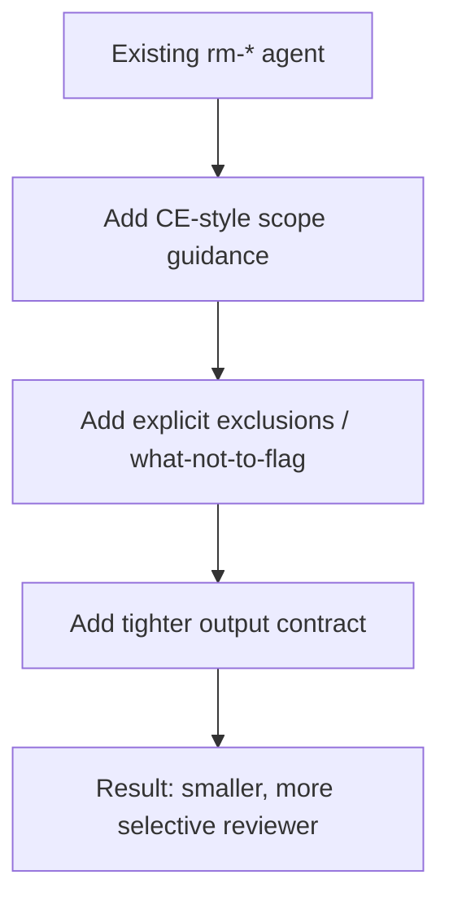

# RM reviewer CE alignment

## Overview

The five `rm-*` reviewer agents are already professional and concise, but they still behave more like standalone lenses than CE-native reviewers. This plan makes them feel like part of the CE review system by tightening their trigger language in frontmatter descriptions, adding CE-style suppression rules, and standardizing their review output to the CE JSON schema so they fit naturally alongside the existing CE personas.

## Problem Frame

The repo now has two reviewer styles: the rich CE personas and the new `rm-*` agents. The `rm-*` set is good enough for direct use, but it is missing the discipline that makes CE reviewers predictable: explicit trigger scope in the frontmatter description, clear non-goals, confidence/suppression guidance, and the CE JSON output contract. Without those additions, the agents are less likely to be selected correctly and more likely to produce generic or noisy review output.

## Requirements Trace

- R1. Each `rm-*` reviewer should state clearly when it should and should not be used.
- R2. Each `rm-*` reviewer should include a CE-style “what not to flag” section to reduce noisy findings.
- R3. Output formats should use the CE JSON review shape and remain consistent across all five agents.
- R4. The five agents should stay simple; the goal is compatibility, not a rewrite into CE clones.
- R5. The new instructions should remain local to the agent files so future edits are self-contained.
- R6. The new `rm-uncle-bob-csharp-reviewer` should receive the same CE-style treatment and remain distinct from the general `rm-dotnet-csharp-reviewer`.

## Scope Boundaries

- Do not replace the CE reviewers.
- Do not add routing logic to `ce:review` as part of this work.
- Do not expand the agents into full policy documents.
- Do not change the review domains themselves; only sharpen how they are expressed and consumed.

## Context & Research

### Relevant Code and Patterns

- `.opencode/agents/rm-dotnet-csharp-reviewer.md` — concise .NET reviewer with output sections but no suppression rules.
- `.opencode/agents/rm-powershell-reviewer.md` — concise PowerShell reviewer with style/security focus.
- `.opencode/agents/rm-blazor-reviewer.md` — concise Blazor reviewer with architecture/perf/accessibility focus.
- `.opencode/agents/rm-html-css-blazor-reviewer.md` — concise UI reviewer with semantic HTML/CSS focus.
- `.opencode/agents/rm-uncle-bob-csharp-reviewer.md` — stricter C# craftsmanship reviewer that still needs CE-style scope and output discipline.
- `.opencode/agents/ce/testing-reviewer.md` — strong example of CE-style scope, what-not-to-flag, and confidence calibration.
- `.opencode/agents/ce/security-reviewer.md` — strong example of CE-style confidence thresholds and explicit exclusions.
- `.opencode/agents/ce/project-standards-reviewer.md` — strong example of “cite the rule, cite the diff” discipline for narrow review territories.

### Institutional Learnings

- `docs/solutions/integration-issues/fix-skill-overtriggering-2026-04-03.md` — trigger descriptions need positive scope, exclusions, and escape hatches.
- `docs/solutions/integration-issues/opencode-instruction-architecture-pattern-2026-04-03.md` — keep custom instruction content isolated, lazy-loaded, and easier to reason about.
- `docs/solutions/integration-issues/opencode-instruction-management-lessons-2026-04-03.md` — use precise descriptions and avoid weak trigger language.

### External References

- OpenCode agent configuration supports per-agent prompts, permissions, and mode control.
- The CE reviewer files provide the target shape: scoped triggers, exclusions, and structured review output.

## Key Technical Decisions

- Keep the agents short and opinionated; add only the missing CE-compatible metadata and guardrails.
- Prefer a small standard pattern repeated across all five agents over bespoke per-agent structures.
- Add explicit “use when / do not use when” guidance in the frontmatter description so the agents are less ambiguous when selected.
- Add suppression guidance tailored to each agent’s domain, rather than generic best-practice lists.
- Keep output formats aligned across the five agents so downstream consumption is predictable and CE-compatible.

## Open Questions

### Resolved During Planning

- Should these agents become full CE personas? No — they should remain compact and easy to read.
- Should the five agents share one common template? Yes — a shared review skeleton reduces drift.

### Deferred to Implementation

- Whether any agent should emit additional helper sections beyond the CE JSON schema.
- Whether `rm-blazor-reviewer` and `rm-html-css-blazor-reviewer` need only distinct wording or also distinct default examples.

## High-Level Technical Design

> _This illustrates the intended approach and is directional guidance for review, not implementation specification. The implementing agent should treat it as context, not code to reproduce._

## Implementation Units

- [ ] **Unit 1: Add CE-style scope language to the five rm reviewers**

**Goal:** Make each agent’s trigger scope explicit so it is easier to use correctly and less likely to be selected for the wrong kind of change.

**Requirements:** R1, R4, R5

**Dependencies:** None

**Files:**

- Modify: `.opencode/agents/rm-dotnet-csharp-reviewer.md`
- Modify: `.opencode/agents/rm-powershell-reviewer.md`
- Modify: `.opencode/agents/rm-blazor-reviewer.md`
- Modify: `.opencode/agents/rm-html-css-blazor-reviewer.md`

**Approach:**

- Add short trigger guidance in the frontmatter description of each agent describing the exact change types it should review.
- Keep the wording narrow enough to match CE-style selection without turning the agent into a general-purpose reviewer.
- Preserve the existing tone and brevity.

**Patterns to follow:**

- CE reviewer descriptions that state when the persona is selected.
- Existing rm-agent tone: direct, professional, concise.
- CE frontmatter descriptions that encode selection scope up front.

**Test scenarios:**

- **Happy path:** A C# code diff naturally matches `rm-dotnet-csharp-reviewer` scope language.
- **Happy path:** A Blazor component diff clearly matches `rm-blazor-reviewer` scope language.
- **Happy path:** A PowerShell script diff clearly matches `rm-powershell-reviewer` scope language.
- **Happy path:** A Razor/HTML/CSS layout change clearly matches `rm-html-css-blazor-reviewer` scope language.
- **Edge case:** A config-only or docs-only change should not read like a fit for the wrong reviewer.

**Verification:**

- Each agent’s frontmatter description makes its intended use obvious at a glance.

- [ ] **Unit 2: Add “what not to flag” guidance per agent**

**Goal:** Reduce noisy or out-of-scope findings by giving each reviewer a small exclusion list.

**Requirements:** R2, R4

**Dependencies:** Unit 1

**Files:**

- Modify: `.opencode/agents/rm-dotnet-csharp-reviewer.md`
- Modify: `.opencode/agents/rm-powershell-reviewer.md`
- Modify: `.opencode/agents/rm-blazor-reviewer.md`
- Modify: `.opencode/agents/rm-html-css-blazor-reviewer.md`

**Approach:**

- Borrow the CE pattern of saying what the reviewer explicitly does not police.
- Keep exclusions domain-specific and short.
- Ensure the exclusions suppress subjective “taste” feedback that would create noise.

**Patterns to follow:**

- `ce/testing-reviewer` suppression section.
- `ce/security-reviewer` explicit non-goals.

**Test scenarios:**

- **Happy path:** The C# reviewer ignores pure formatting/style nits when they do not affect correctness or maintainability.
- **Happy path:** The PowerShell reviewer avoids flagging one-off scripting preferences that are not security or execution issues.
- **Happy path:** The Blazor reviewer avoids general front-end aesthetic commentary unrelated to Blazor behavior or rendering.
- **Happy path:** The HTML/CSS reviewer ignores arbitrary taste opinions and sticks to semantic/layout concerns.
- **Edge case:** Trivial non-behavioral edits should not produce high-importance review language.

**Verification:**

- Each reviewer is more selective and produces fewer irrelevant findings.

- [ ] **Unit 3: Normalize review output structure across the five agents**

**Goal:** Make the agents easier to consume by giving them the shared CE JSON response shape.

**Requirements:** R3, R5

**Dependencies:** Unit 1

**Files:**

- Modify: `.opencode/agents/rm-dotnet-csharp-reviewer.md`
- Modify: `.opencode/agents/rm-powershell-reviewer.md`
- Modify: `.opencode/agents/rm-blazor-reviewer.md`
- Modify: `.opencode/agents/rm-html-css-blazor-reviewer.md`

**Approach:**

- Align the output to the CE JSON schema so the five reviewers feel like siblings.
- Use the shared `reviewer` / `findings` / `residual_risks` / `testing_gaps` shape from CE.
- Ensure each agent still reports positives, blockers, and improvements through structured findings rather than prose.

**Patterns to follow:**

- `ce/testing-reviewer` JSON output contract as a reference for predictability.
- Current rm-agent focus areas and concise tone.

**Test scenarios:**

- **Happy path:** Each agent emits the same CE JSON schema on a representative review response.
- **Edge case:** A review with no issues still produces a valid, compact JSON payload.
- **Edge case:** A blocking issue remains clearly separated from lower-priority findings via structured severity fields.

**Verification:**

- The five agents are easy to parse by downstream tooling and remain consistent with CE reviewers.

- [ ] **Unit 4: Define the Blazor vs HTML/CSS reviewer boundary**

**Goal:** Eliminate overlap between `rm-blazor-reviewer` and `rm-html-css-blazor-reviewer` by making their scopes distinct and complementary.

**Requirements:** R1, R4

**Dependencies:** Unit 1

**Files:**

- Modify: `.opencode/agents/rm-blazor-reviewer.md`
- Modify: `.opencode/agents/rm-html-css-blazor-reviewer.md`

**Approach:**

- Define `rm-blazor-reviewer` as component architecture, rendering, lifecycle, and Blazor-specific behavior.
- Define `rm-html-css-blazor-reviewer` as semantic HTML, CSS architecture, responsive layout, and styling consistency.
- Add one short disambiguation line in each file so a mixed Razor diff has a clear primary reviewer.

**Patterns to follow:**

- CE split between UI timing/race behavior and framework opinionated architecture reviewers.
- CE reviewer guidance that uses a single dominant lens per agent.

**Test scenarios:**

- **Happy path:** A component lifecycle/rendering diff maps to `rm-blazor-reviewer`.
- **Happy path:** A markup/CSS/responsive design diff maps to `rm-html-css-blazor-reviewer`.
- **Edge case:** A mixed Razor file with both markup and component logic has a clear primary reviewer and a secondary reviewer.
- **Edge case:** The same diff no longer reads as equally suited to both agents.

**Verification:**

- The two agents have a clear boundary that reduces overlap and selection ambiguity.

## System-Wide Impact

- **Interaction graph:** No new runtime routing is introduced; this work affects only agent content.
- **Error propagation:** The main risk is noisy or ambiguous reviews, not functional breakage.
- **State lifecycle risks:** None beyond content drift between the five agents if they are edited inconsistently.
- **API surface parity:** Output shape consistency matters if other tools or agents read these reviews.
- **Integration coverage:** Reviewers should still remain lightweight enough to use directly without CE routing.
- **Unchanged invariants:** The five `rm-*` agents remain separate from CE personas and keep their current scope domains.

## Risks & Dependencies

| Risk                                                             | Mitigation                                                                  |
| ---------------------------------------------------------------- | --------------------------------------------------------------------------- |
| Adding too much CE-style material makes the agents verbose       | Keep the additions short and repeatable across all five files               |
| Over-specified exclusions make the agents miss useful findings   | Use narrow, domain-specific suppressions with an escape hatch for real risk |
| Output format drift across the five agents creates inconsistency | Standardize the section order and naming in all five files                  |

## Documentation / Operational Notes

- No docs update required unless the repo maintains a central agent index.
- Keep descriptions concise so the agents remain easy to skim in `.opencode/agents/`.

## Sources & References

- **Related code:** `.opencode/agents/rm-dotnet-csharp-reviewer.md`
- **Related code:** `.opencode/agents/rm-powershell-reviewer.md`
- **Related code:** `.opencode/agents/rm-blazor-reviewer.md`
- **Related code:** `.opencode/agents/rm-html-css-blazor-reviewer.md`
- **Related code:** `.opencode/agents/rm-uncle-bob-csharp-reviewer.md`
- **Related code:** `.opencode/agents/ce/testing-reviewer.md`
- **Related code:** `.opencode/agents/ce/security-reviewer.md`
- **Related code:** `.opencode/agents/ce/project-standards-reviewer.md`
- **Related docs:** `docs/solutions/integration-issues/fix-skill-overtriggering-2026-04-03.md`
- **Related docs:** `docs/solutions/integration-issues/opencode-instruction-architecture-pattern-2026-04-03.md`
- **Related docs:** `docs/solutions/integration-issues/opencode-instruction-management-lessons-2026-04-03.md`
